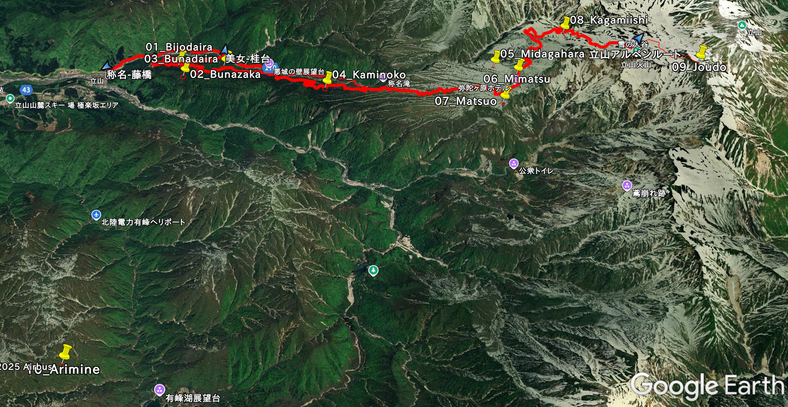
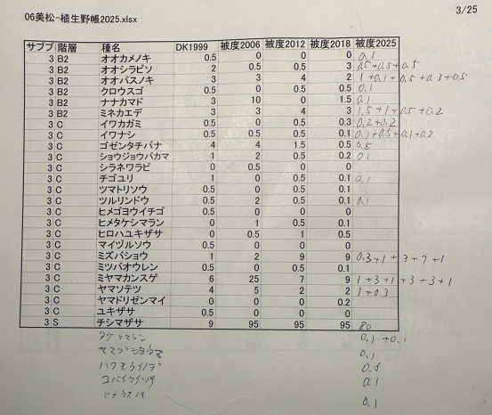
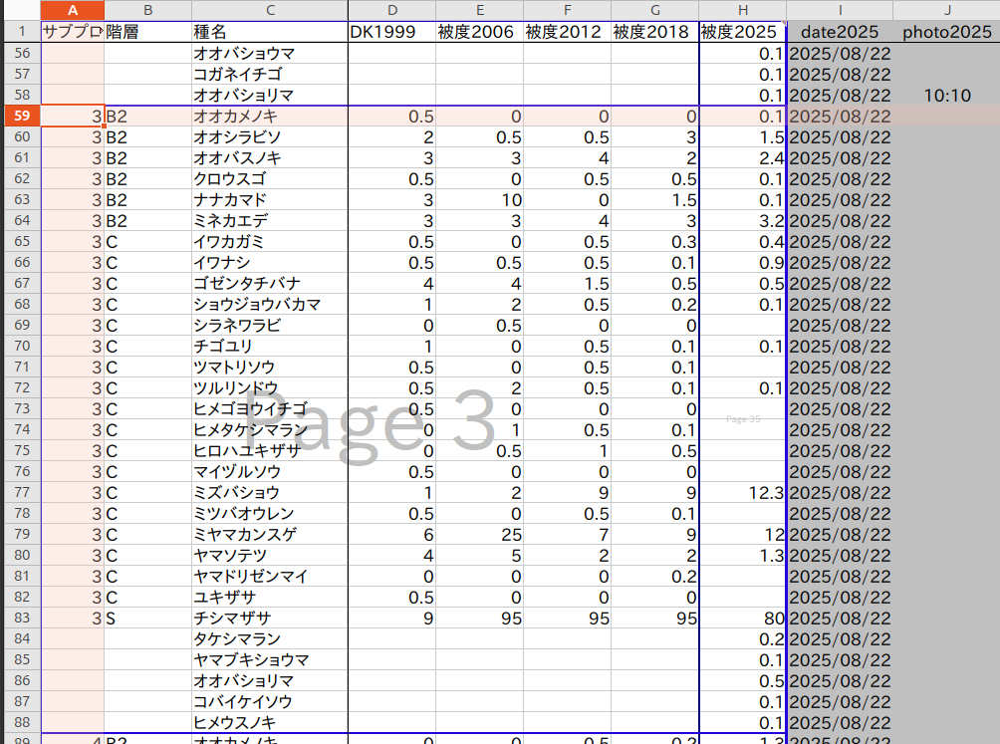
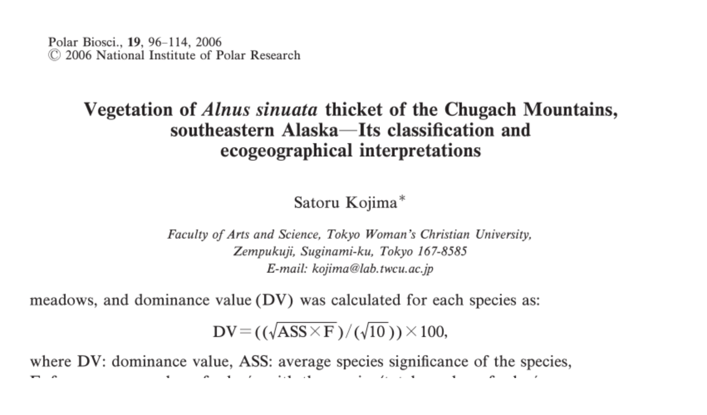
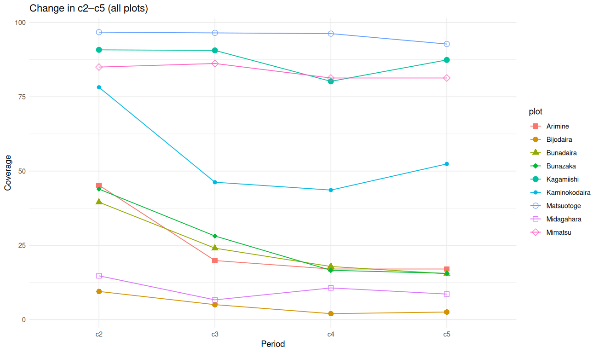
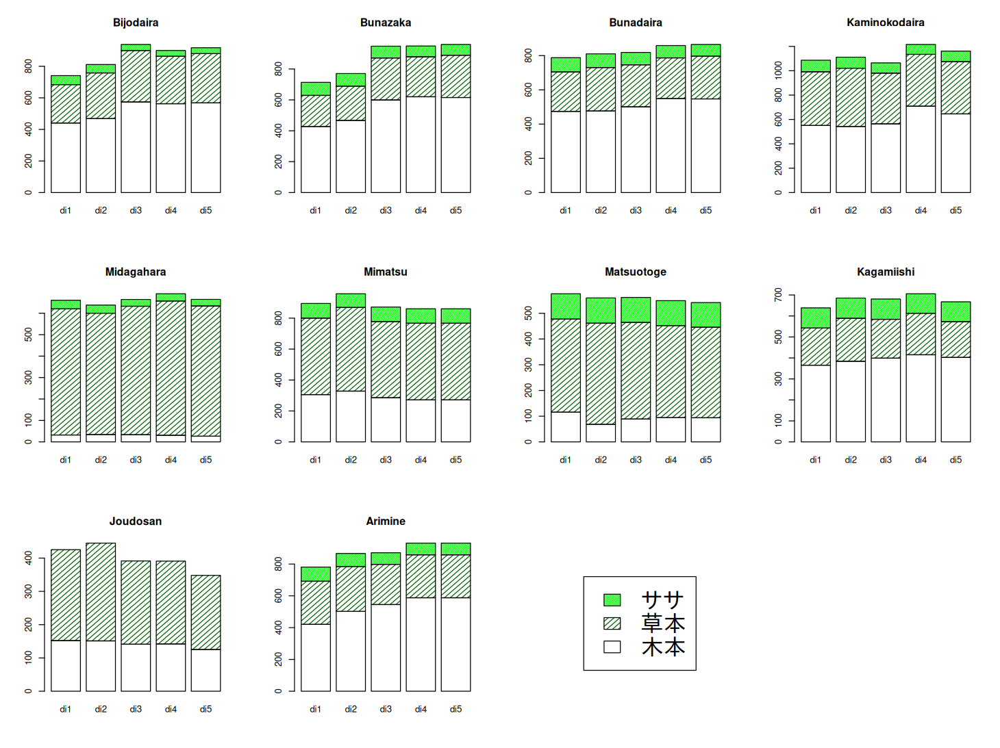

# RパッケージTateyamaVegetationのインストール

これまでの調査データと報告書用の集計・作図のスクリプトをまとめています。

## GitHubからのインストール
[TateyamaVegetation](https://github.com/ishidamgm/TateyamaVegetation)

* zipでダウンロードしローカルでインストール

* もしくは以下のコマンドでインストールとしてください

# パッケージのインストール
install.packages("devtools")   # 未導入なら
devtools::install_github("ishidamgm/TateyamaVegetation")

必要なパケージがある場合は適宜インストールしてください

```{r}
#関連パッケージ
library(ggplot2)
library(ggrepel)
```


# ヘルプ・データ一覧
```{r}
library(TateyamaVegetation)
 help(package="TateyamaVegetation")
 data(package="TateyamaVegetation")
```


# 調査地



[Tateyama_Alpine_route.kml](gis/Tateyama_Alpine_route.kml)

[Tateyama_Vegetation_Monitoring_Plots Tracks.kml](gis/Tateyama_Vegetation_Monitoring_Plots Tracks.kml)

```{r}
plt
```

```{r}
options(dplyr.width = Inf)

tibble::as_tibble(vv)

tibble::as_tibble(flora)


```

## 調査年
```{r}
VegetationSurveyYears 
VegetationYearsMatrix#[1:5,"Arimine"]
```


## 植物目録の作成

## 野帳の作成

```{r}
FieldNote_Arimine2019_raw
```

## 野帳の入力支援

* 階層整え
* 植物目録未登録種の確認(ミスインプットの検出含む))
* 重複種の合算
```{r}
d<-FieldNote_Arimine2019_raw
head(d)
SpeciesNameCheck(d$種名)
```

# 野外調査の準備

## 植生調査野帳の作成　(有峰と美松の事例)

```{r}
### エクセル・ファイルの書き込みに必要なパッケージ
#library(openxlsx2)

### データの読み込み
Arimine_lbl<-VegetationSurveyYears[plt$plot_name=="Arimine",c("Vegetation001","Vegetation002","Vegetation003","Vegetation004","Vegetation005")]
Mimatsu_lbl<-VegetationSurveyYears[plt$plot_name=="Mimatsu",c("Vegetation001","Vegetation002","Vegetation003","Vegetation004","Vegetation005")]

df<-vv[vv$plot=="Arimine",]
names(df)[6:10]<-Arimine_lbl

df2<-vv[vv$plot=="Mimatsu",]
names(df2)[6:10]<-Mimatsu_lbl

### ワークブックとワークシートの作成
wb <- openxlsx2::wb_workbook()
wb$add_worksheet("Arimine")
wb$add_worksheet("Mimatsu")

### データの書き込み
wb$add_data("Arimine", df, start_row = 1, start_col = 1)
wb$add_data("Mimatsu", df2, start_row = 1, start_col = 1)

### サブプロットが変わる位置で改ページ（行番号 + 1）
subplot_changes <- which(diff(df$subplot) != 0)
page_breaks <- subplot_changes + 1  # データ行に対して +1

### 改ページの設定（openxlsx2用）
openxlsx2::wb_add_page_break(wb,  row = page_breaks)

# 保存
#wb$save("立山植生野帳2025.xlsx", overwrite = TRUE)
```

## 植生調査用の樹木位置図の作成

```{r warning=FALSE}

treemap("Arimine")
 treemap("Arimine")+ ggplot2::xlim(c(-5, 55))+ ggplot2::ylim(c(-5, 60))
 
```


# 野帳入力と集計

## 入力

野外調査で植生調査記録ExelやCalcで，スプレッド・シートに植生調査記録したデータを入力します







## 野帳データの整理　(R)

### ワーキング・ディレクトリの設定

### 入力値の異常値が無いか確認

###　空白埋め

サブプロットと階層が空白になっているのを埋める


## 集計・作図作業

### 被度とDomin-Krajina変換

被度(一般的な被覆率)とDomin-Krajina被度の関係

```{r}
Domin_Krajina

cover<-seq(0,100,1)
plot(cover, Domin_Krajina(cover),type="l")
```

### 総合優占度(Kojima2006)の計算





総合優占度 = 100 * sqrt(平均被度 * 出現頻度 / sqrt(10)


## 2025年度の事例


### 美松・有峰

```{r, warning=FALSE}
# treemap("Amimine")
# treemap("Mimatsu")+ ggplot2::ylim(c(45, 105))
treemap("Arimine")+ ggplot2::xlim(c(-5, 55))+ ggplot2::ylim(c(-5, 55))
```

# これまでの結果
```{r}
subset(vv,plot=="Arimine")
```
## 植生表
```{r}
names(VT)
VT[["Arimine_c04" ]]
```


## 植生表
```{r}
names(VT)
VT[["Arimine_c04" ]]
```


# I-V集計表
## 1. 美女平
```{r}
plot_name　<-　"Bijodaira"
DT_VCrepo(plot_name)
Fig_FrequencyCoverage(plot_name=plot_name,x="f5",y="c5")
Fig_FrequencyDominace(plot_name=plot_name,x="f5",y="di5")

```


## 2. ブナ坂
```{r}
plot_name　<-　"Bunazaka"
DT_VCrepo(plot_name)
Fig_FrequencyCoverage(plot_name=plot_name,x="f5",y="c5")
Fig_FrequencyDominace(plot_name=plot_name,x="f5",y="di5")
```

## 3. ブナ平
```{r}
plot_name　<-　"Bunazaka"
DT_VCrepo(plot_name)
Fig_FrequencyCoverage(plot_name=plot_name,x="f5",y="c5")
Fig_FrequencyDominace(plot_name=plot_name,x="f5",y="di5")
```

## 4. 上ノ小平
```{r}
plot_name　<-　"Kaminokodaira"
DT_VCrepo(plot_name)
Fig_FrequencyCoverage(plot_name=plot_name,x="f5",y="c5")
Fig_FrequencyDominace(plot_name=plot_name,x="f5",y="di5")
```

## 5. 弥陀ヶ原
```{r}
plot_name　<-"Midagahara"
DT_VCrepo(plot_name)
Fig_FrequencyCoverage(plot_name=plot_name,x="f5",y="c5")
Fig_FrequencyDominace(plot_name=plot_name,x="f5",y="di5")
```

## 6. 美松
```{r}
plot_name　<-　"Bunazaka"
DT_VCrepo(plot_name)
Fig_FrequencyCoverage(plot_name=plot_name,x="f5",y="c5")
Fig_FrequencyDominace(plot_name=plot_name,x="f5",y="di5")
```

## 7. 松尾峠
```{r}
plot_name　<-　"Mimatsu"
DT_VCrepo(plot_name)
Fig_FrequencyCoverage(plot_name=plot_name,x="f5",y="c5")
Fig_FrequencyDominace(plot_name=plot_name,x="f5",y="di5")
```

## 8. 鏡石
```{r}
plot_name　<-　"Matsuotoge"
DT_VCrepo(plot_name)
Fig_FrequencyCoverage(plot_name=plot_name,x="f5",y="c5")
Fig_FrequencyDominace(plot_name=plot_name,x="f5",y="di5")
```

## 9. 浄土山
```{r}
plot_name　<-　"Joudosan"
DT_VCrepo(plot_name)
Fig_FrequencyCoverage(plot_name=plot_name,x="f5",y="c5")
Fig_FrequencyDominace(plot_name=plot_name,x="f5",y="di5")
```

## 10. 有峰
```{r}
plot_name　<-　"Arimine"
DT_VCrepo(plot_name)
Fig_FrequencyCoverage(plot_name=plot_name,x="f5",y="c5")
Fig_FrequencyDominace(plot_name=plot_name,x="f5",y="di5")
```

# 全体
## ササの年次変動



# 植物目録
[植物目録](FloraList_V.html)


[FloraList Arimine](FloraList_Arimine.html)


```{r}

DT::datatable(
  flora[, c("spj", "form", "sp")],
  options = list(pageLength = 10),
  caption = "植物目録"
)

#flora[, c("spj","form", "sp")]

# knitr::kable(
#   flora[, c("form","spj", "sp")], caption = '植物目録'
# )

```


```{r, results='asis'}
# DT::datatable(
#   tibble::as_tibble(flora)[, c("spj", "sp", "美女", "ブナ坂", "ブナ平", "上の小", 
#                             "弥陀ヶ原", "美松", "松尾峠", "鏡石", "浄土", "有峰")],
#   options = list(
#     pageLength = 10,       # 1ページあたりの行数
#     scrollX = TRUE         # 横スクロールを有効にする
#   )
# )
```

 
# 謝辞

APG植物目録() 米倉浩司・梶田忠 (2007-) 植物和名ー学名インデックスYList を利用させていただきました。


# 引用文献

